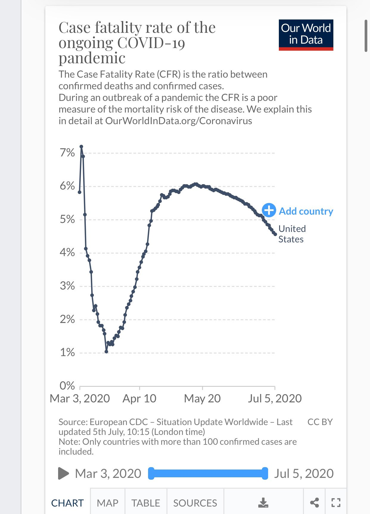

There is a limit to the power of positive thinking.
At every stage Trump has voiced a rosy scenario about the coronaviurs,
only 15 cases,
it will be gone by summer.
Persistently the negative truth presents itself.
The coronavirus is a threat to be reckoned with and not dismissed.

## Trump loyalist are contributing to his dysfunction

I believe the loyal Trump supporters in the White house are still presenting
him with rosy pictures.
Pleasing Trump is more important than factual presenttions.
Reality has a very tough way of presenting itself in light of the coronavirus.
But the rosy supporters may just move on.

Ever read the fine print? During a pandemic outbreak CFR is a poor measure of fatality rate for the disease. It is on your graphic?

On July 7,2020 I posted a tweet about a graphic in a tweet posted by the
Trump War Room. Which includes a disclaimer about CFR (Case Fatality Rate) being a poor
metric of fatality rate of the virus.

[The Tweet](https://x.com/TrumpWarRoom/status/1280693713077972994) with these graphcs:

The president has waved around graphs during the Jonathon Swan interview,
what is the source of those charts.
During the interview Trump insisted that cases are the only thing that mattered
and per capita death rates are to me ignored.
This is not a rational position.

If you look at the website of the July 7 post you can see various statistics
and most of them show how poorly the United States is doing relative to other
countries in handling the coronavirus.

## This is a problem for the Trump and Republican elections.

Over half the population knows somebody that has had the coronavirus.
There are 2.3 million official cases, the infection rate is estimated to be 10x the case rate so 23 million.
The population of the United States is 320 million.
If people know about 20 distinct people that can cover the population.

The denial game will not work in this case like many other Trump Foes.
The coronavirus cannot be forced away from the news cycle,
it returns with the increasing death toll.
Calls to open schools and asking parent to put their children at risk
are callous and every school case will be echoed in the press.
This is unlikely to go away by election day.

Trump has been spreading FUD about the 2020 election since 2016.
Changing the election day, mail in ballots, no real substance just FUD.
